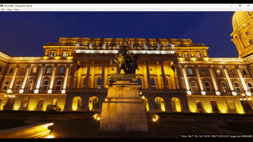

# Pano.Net

Interactive viewer for equirectangular (360x180 degree) panoramas.

## Usage

* Build and run the application.
  * .NET Framework 4.8 is required.
* Open an image using File/Open. Currently only JPG images are supported.
  * A sample image is provided in the 'Samples' folder. 
* Click and move the mouse to move around, scroll to zoom.
